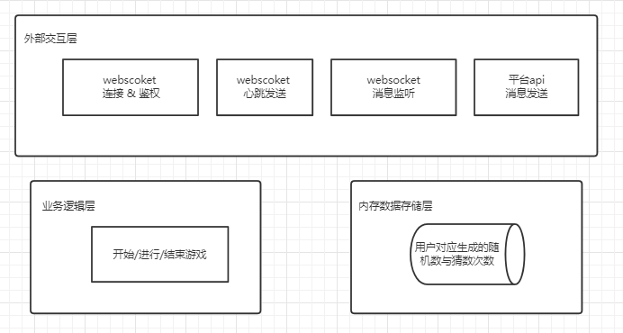
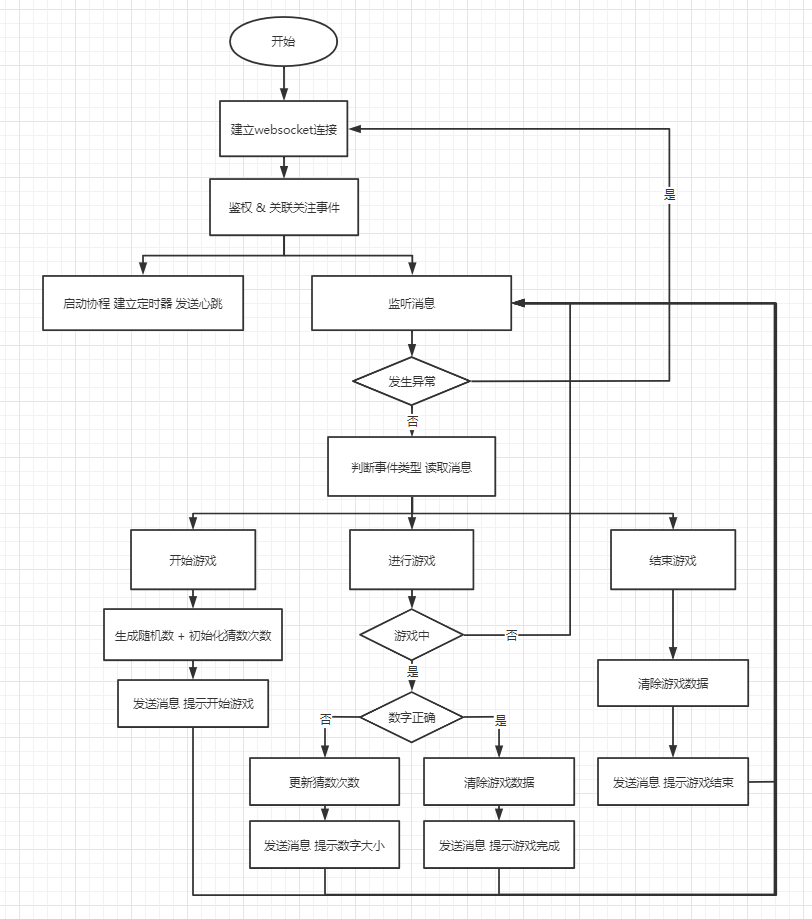

机器人设计主题：猜数

### 介绍
启动入口： server.go > main

用户可以通过@机器人并输入对应的内容进行猜数游戏，程序通过websocket连接服务器接收用户发送的消息、通过开发平台Api 进行用户消息的回复进行互动

开始游戏：@猜数机器人并输入“开始猜数”，例：@猜数机器人 开始猜数

进行游戏：@机器人并输入所猜的阿拉伯数字，例：@猜数机器人 50

结束游戏：@猜数机器人并输入“结束猜数”，例：@猜数机器人 结束猜数

### 方案设计

- 消息交互

接收消息：由于需要实时接收用户消息，采用websocket方式与服务器建立连接，实时接受服务器消息推送

心跳：在长时间没有消息交互时，可能会导致底层TCP连接断连而上层协议未感知异常，需要定时发送心跳包，由于主协程需要处理实时接收消息的逻辑，心跳发送另启动一个协程，触发定时器发送心跳

发送消息：平台api有提供发送消息的http接口，可将消息封装请求调用接口即可

- 数据存储

   使用内存Map存储，key：频道id + 用户id，value：用户游戏生成的随机数 + 猜数次数

### 架构

### 流程

